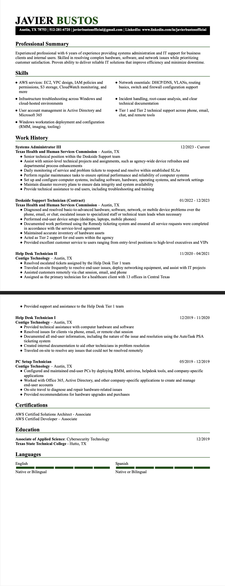

# Frontend Technical Specification

- Create a static website that serves an html resume.

## Resume Considerations

For now, I want to use my [existing resume](./docs/myresume.jpg) as the base for this website. Fromat tweaks and adjustments will likely occur, but for now I just want to get this up.

### Existing Resume Format Generation

To be efficient, I am going to leverage AI to assist in converting my resume into HTML and CSS. I'll adjust any elements as needed to conform to my desired format.

Prompt used in ChatGPT 5.2:

```text
Convert this resume into HTML. Maintain style, format, and text.
```

Below image was provided along with prompt:

 

This is the [generated output](./docs/resume_aigen_12-27-25.html). And below is what it looks like visually before any alterations:


I'd say it did a pretty good job as a first draft, but I do see some issues with some words being bolded that shouldn't be, and it's definetely more cramped than I'd like. I'll be rafactoring the code to improve readability and formatting at a later point, but for now this is good enough for an MVP.

I went ahead and instructed Chat GPT to split the original output into separate .html and .css files, which are now located [here](./public/)

## Serve Static Website Locally

So I changed my mind - I am going to adjust the resume's HTML and CSS now rather than later. 

To do that, I am going to serve the static website locally so I can view any html or style changes I make and perform adjustments efficiently.


### Install HTTP Server

I will enter the below command to install http-server into our current environment.

```sh
npm i http-server -g
```

https://www.npmjs.com/package/http-server

### Serve Website

http-server will serve the public folder by default where the command is run. So I will move into the "frontend" directory.

```sh
cd frontend
```
Then I will enter the following command:

```sh
http-server
```
As you can see, the http server is now serving ./public


And here's what the site looks on the locally hosted http server

