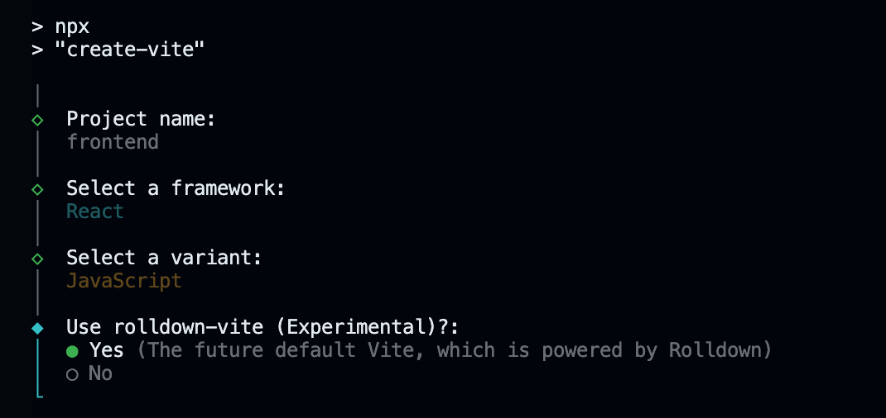

# Frontend Technical Specification

- Create a static website that serves an html resume.

## Resume Considerations

For now, I want to use my [existing resume](../old/docs/myresume.jpg) as the base for this website. Format tweaks and adjustments will likely occur, but for now I just want to get a first draft set up.

### Existing Resume Format Generation

To avoid spending excesive time on hand coding the HTML from scratch, I am going to leverage AI to assist in converting my resume into HTML and CSS. I'll adjust any elements as needed to conform to my desired format.

Prompt used in ChatGPT 5.2:

```text
Convert this resume into HTML. Maintain style, format, and text.
```

Below image was provided along with prompt:

 

This is the [generated output](../old/docs/resume_aigen_12-27-25.html). And below is what it looks like visually before any alterations:


I'd say it did a pretty good job as a first draft, but I do see issues with some words being bolded that shouldn't be, and it's definetely a bit cramped. I'll be rafactoring the code to improve readability and formatting at a later point, but for now this is good enough for an MVP.

I went ahead and instructed Chat GPT to split the original output into separate .html and .css files, which are now located [here](../old/public/)

## Serve Static Website Locally

So I changed my mind - I am going to adjust the resume's HTML and CSS now rather than later. 

To do that, I am going to serve the static website locally so I can view any html or style changes I make and perform adjustments on the fly.


### Install HTTP Server

I will enter the below command to install http-server into our current cloud environment (assuming we have node installed. If not, install first)

```sh
npm i http-server -g
```

https://www.npmjs.com/package/http-server

### Serve Website

http-server will serve the public folder by default where the command is run. So I will move into the "frontend" directory.

```sh
cd frontend
```
Then I will enter the following command:

```sh
http-server
```
As you can see, the http server is now serving ./public


And here's what the site looks on the locally hosted http server


## HTML/CSS Adjustments

Did some restructuring of the HTML code to better separate out the elements for editing. Added a navigation bar, since this site will consist of a few pages, and did some adjustments to the line spacing, font sizing, and bolding of the text. Here is the current result:


## Frontend Configuration

Will be using React to build the frontend (as it's one of the more popular frameworks) along with vite.js as the build tool.

Is this necessary? No. I could very well just serve static pages, but I think the value I'll gain from learning these tools is worth it.

### Vite.js Installation

To install Vite.js, I visited vite.dev and grapped the npm installation command from their guide and ran it in my Cloud Development Environment (CDE) terminal:

```sh
npm create vite@latest
```

Since I want the target directory for Vite to be the [`frontend`](../frontend/) folder, I will need to rename the current folder, since Vite will load files into the directory and I don't want to mess with anything I currently have in there. I will rename it `frontend-dev` (later renamed [`old`](../old)), create a new `frontend` folder, and install Vite there.

Moving forward with the installation, I will select React for the framework JavaScript for the Variant, and will be using Rolldown-Vite



Installation is now complete.

### Starting the Vite Local Development Server

I will now be starting the local dev server so I can see changes I make to React components in near-real time.

To start it, I will run:

```sh
cd frontend
npm run dev
```

This command runs the dev script defined in the `package.json` file. It starts a local dev server, with a default url of http://localhost:5173.


### Porting index.html Into React Components

React apps work by composing different components together and rendering them dynamically in the browser using JavaScript. I will need to refactor the existing index.html file into separate React components (files), written in JSX.

I will start by creating a component called [`Header.jsx`](./src/components/Header.jsx), which will contain the markup for the navigation bar.

A separate component will also be created called [`ResumePage.jsx`](./src/components/ResumePage.jsx), which will consist of the resume itself

The parent component which will hold both `Header.jsx` and `ResumePage.jsx` will be called [`ResumeTab.jsx`](./src/pages/ResumeTab.jsx).


### React Router

Now we need to get React Router set up with the web app. React Router will allow us to map URLs to different components, enabling the app to control which components render based on the URL, without requiring a full page reload. 

For example, we can map the `ResumeTab.jsx` component to `/resume`, and do the same for any other pages added in the future.

To install:

```sh
npm i react-router --save
```

`--save` will add the dependency to `"dependencies"` in `package.json`. Dependencies listed there are installed for production deployments, so libraries the app needs to run (like React Router) should be listed under "dependencies" rather than "devDependencies".

We'll be using Declarative mode. Full instructions for installation and routing can be found here: https://reactrouter.com/start/declarative/installation

## Webpage Structure

The website will consist of 3 main pages/tabs: Home, Resume, and Projects. 

The structure is as follows:

[`main.jsx`](./src/main.jsx) will contain the routes for our pages.

[`HomeTab.jsx`](./src/pages/HomeTab.jsx), [`ResumeTab.jsx`](./src/pages/ResumeTab.jsx), and [`ProjectsTab.jsx`](./src/pages/ProjectsTab.jsx) will contain the three main pages I mentioned before.

Those three pages will use components defined in [`components`](./src/components/) folder.

Stylesheets will be in the [`stylesheets`](./src/assets/stylesheets/) folder.

### Building Out Remaining of Components

I will now begin building out the other pages and components that will make up the website, along with their styling. For now, I am going for a minimal design that is simple and easy to implement. 

You can view the files in [`pages`](./src/pages/), [`components`](./src/components/) and [`stylesheets`](./src/assets/stylesheets/)

### Mock View Counter
The final product will have a view counter implemented into the Home tab of the website. It will consist of an AWS Lambda function, API Gateway endpoint, and DynamoDB table. Since I still haven't configured the cloud infrastructure which will host the website, I will be creating a local ‘mock’ view counter that will later be replaced with a cloud-backed implementation. 

I will be creating a new [`ViewCounter.jsx`](./src/components/ViewCounter.jsx) component that will be rendered in `HomeTab.jsx`

The mock api endpoint will be hosted on the Vite local dev server. This will be done by definining a mock middleware in [`vite.config.js`](./vite.config.js) using the following configuration:

```js
const mock_server = {
  name: "mock-counter-api",
  configureServer(server) {
    let count = 0;

    server.middlewares.use("/counter", (req, res, next) => {
      if (req.method !== "GET" && req.method !== "POST") return next();

      if (req.method === "POST") count += 1;

      res.statusCode = 200;
      res.setHeader("Content-Type", "application/json");
      res.end(JSON.stringify({ count }));
    });
  },
};

export default defineConfig({
  plugins: [react(),mock_server],
})
```


The endpoint address will be stored in [`.env`](./.env) using the `VITE_COUNTER_ENDPOINT` environment variable. The endpoint is just the address of the Vite local dev server. 

```
VITE_COUNTER_ENDPOINT=https://stunning-trout-pj459qpwj9663rgwr-5173.app.github.dev
```

One thing to note is that the mock counter resets every time the dev server is restarted. This is okay, since this is a "mock" implementation after all. 

## Mobile Styling

Time to configure mobile styling for the website. To configure mobile styling, I will be using breakpoints to ensure the website renders in a preconfigured way based on viewport width. Once the viewport width exceeds a pre-defined threshold (for example, going from a cell phone to a desktop monitor), the styling changes to make better use of the available space. This maintains readability and usability across multiple screen sizes.  

To implement this in an efficient way, I will be using PostCSS `@custom-media` queries to act as named references for the breakpoints I will be defining. This will aid in defining a set viewport width threshold in pixels and ensuring styles are uniform across the pages without having to explicitly define it in every page. 

### PostCSS

To use `@custom-media`, we will need to install `postcss-preset-env`:

```sh
npm i -D postcss postcss-preset-env
```

I will define the configuration in a file called `postcss.config.js`. This file will be created in the Vite project root with the following:

```js
export default {
  plugins: {
    'postcss-preset-env': {
      stage: 1,
      features: {
        'custom-media-queries': true, // enables @custom-media
        'nesting-rules': true,         // enables CSS Nesting
      },
    },
  },
};
```

Now `@custom-media` and CSS Nesting is enabled for the website. Vite will automatically use the configuration file during development and build whenever it processes CSS. 

### Breakpoints
Before applying breakpoints, first we need to define them. This will be done via the [`breakpoint.css`](./src/assets/stylesheets/breakpoint.css) file. I will only be defining two different viewport width thresholds, using the following configuration:

```css
@custom-media --small-only (width < 768px);
@custom-media --above-small (width >= 768px);
```

### Applying Breakpoints

For each of the [`stylesheets`](./src/assets/stylesheets/) that need to use these breakpoints, I will import the `breakpoint.css` file created earlier. The following rule will need to be added at the top of each .css file where mobile styling will be set up:

```css
@import './breakpoint.css';
```

After importing, we can then add the css styling for each of the custom media references defined earlier. I only used the `--small-only` since I found that is all I needed. 

For example:

```css
@media (--small-only){
    /* mobile css goes here */
}
```

## Data Sources
With webpages and styling complete, it's time to start thinking about web content. For the Resume tab, the content will be hardcoded into the [`ResumePage.jsx`](./src/components/ResumePage.jsx) file, but with the Projects and Home tab, I'd like to have it pull data from a JSON file. This way we add data to the file and have it automatically rendered by the website without needing to add a new React component for each project. This wouldn't be an issue with one or two projects/blog posts, but what if I want to add five or ten? Using a JSON data source scales better.

Before setting up a data source, I will create the React components that will render data.

### React Components For Website Data
Two new components will be created. The components will be named `ProjectItem.jsx` and `ProjectPage.jsx`.

`ProjectItem.jsx` will be rendered as part of the Projects tab, where multiple `ProjectItem` components are generated by iterating over the JSON data source. These components will display the project's name, a short summary, a thumbnail image, and a "View Project Details" button that navigates to `ProjectPage.jsx`.

`ProjectPage.jsx` will also contain the project's name, summary, but in addition, the project's description (almost like a blog post). There will also be a button (Back To All Projects) that takes the user back to the Projects tab.

These components will load data from [`projectsData.json`](./src/data/projectsData.json).

`PostItem.jsx` and `PostPage.jsx` will be used for the blog in the Home tab. They will follow the same data-driven pattern as the Project components

### Rendering Markdown
Now we need to think about how we will be building out the data sources for the Projects and Home tab. I want to render markdown, which will be processed into a JSON data source, as this provides maximum flexibility when editing website content. This keeps the React application logic separated from the content itself, reducing the risk of breaking components when making content changes. This approach also scales better when content grows, since each project/blog can live in its own `.md` file.

To implement this pipeline, I will need to add a build-time processing step. A Python script will be used to parse markdown files, convert them to HTML, and generate a JSON data source for the frontend.

This concludes the `frontend` configuration. I will be moving over to the [`README.md`](../backend/README.md) in [`backend`](../backend/) and will continue the documentation from there.
